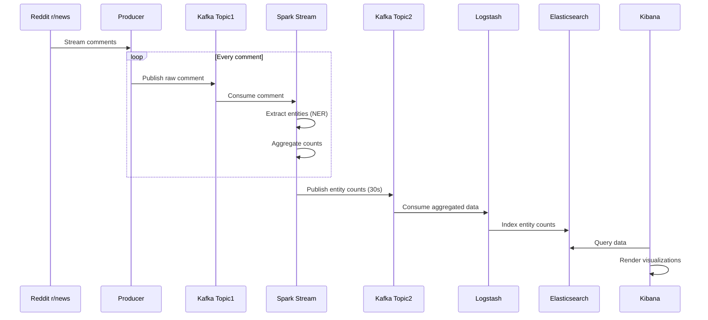
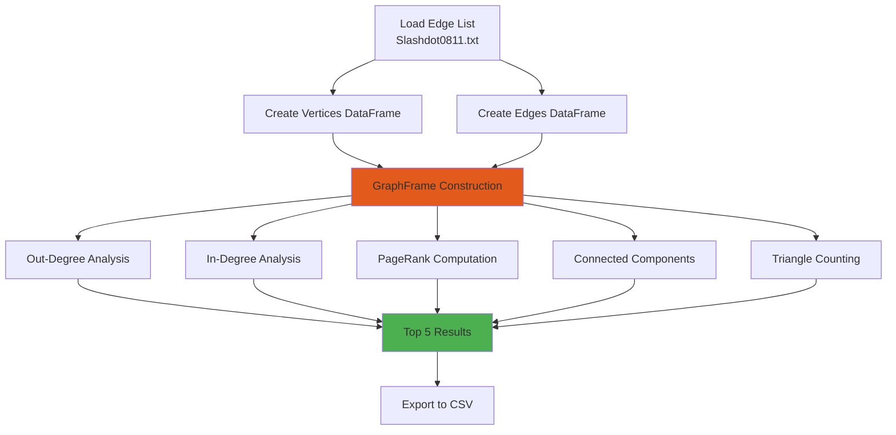

# Big Data Systems Assignment 3


**Author:** Akhila Susarla

**Course:** CS6350 - Big Data Management and Analytics

---

## Abstract

This repository contains two comprehensive big data processing projects that demonstrate real-time stream processing and large-scale graph analytics capabilities. The first project implements an end-to-end Named Entity Recognition (NER) pipeline that processes live Reddit comments in real-time, utilizing Apache Kafka for message streaming, Apache Spark for distributed processing, and the ELK Stack for storage and visualization. The second project performs graph analytics on the Slashdot social network dataset, computing key graph metrics including degree centrality, PageRank, connected components, and triangle counts using PySpark's GraphFrames library. Together, these projects showcase practical applications of distributed computing frameworks for handling streaming data and graph-structured data at scale.

---

## Table of Contents

- [Project Overview](#project-overview)
- [Question 1: Real-time Named Entity Recognition Pipeline](#question-1-real-time-named-entity-recognition-pipeline)
  - [Architecture](#architecture)
  - [Components](#components)
  - [Data Flow](#data-flow)
  - [Technologies Used](#technologies-used)
- [Question 2: Slashdot Social Network Graph Analytics](#question-2-slashdot-social-network-graph-analytics)
  - [Overview](#overview)
  - [Graph Metrics Computed](#graph-metrics-computed)
  - [Technologies Used](#technologies-used-1)
- [Repository Structure](#repository-structure)
- [Prerequisites](#prerequisites)
- [Installation](#installation)
- [Usage](#usage)
- [Results and Visualizations](#results-and-visualizations)
- [License](#license)

---

## Project Overview

This repository demonstrates two key aspects of big data processing:

1. **Real-time Stream Processing**: Building a production-grade streaming pipeline that ingests, processes, and visualizes data in real-time.
2. **Graph Analytics**: Analyzing large-scale social network graphs to extract meaningful insights about network structure and node importance.

---

## Question 1: Real-time Named Entity Recognition Pipeline

### Architecture

The NER pipeline implements a Lambda architecture pattern for real-time text analytics:


### Components

#### 1. Reddit Producer (`1_producer/reddit_producer.py`)

A Python script that streams live comments from Reddit's r/news subreddit:

- **Functionality**: Connects to Reddit API using PRAW (Python Reddit API Wrapper)
- **Output**: Publishes JSON messages to Kafka topic `topic1`
- **Data Structure**: Each message contains:
  - `body`: Comment text
  - `author`: Username
  - `created_utc`: Timestamp
  - `id`: Unique comment ID
  - `subreddit`: Source subreddit name
- **Rate Limiting**: Implements 100ms sleep interval to prevent broker overload

#### 2. Spark NER Processor (`2_spark/ner_stream.py`)

A PySpark Structured Streaming application that performs Named Entity Recognition:

- **Input**: Reads from Kafka `topic1`
- **Processing**:
  - Extracts named entities using NLTK's `ne_chunk`
  - Identifies PERSON, ORGANIZATION, GPE (Geopolitical Entity), and other entity types
  - Maintains running aggregated counts of each entity
- **Output**: Publishes entity counts to Kafka `topic2` every 30 seconds
- **NER Pipeline**:
  ```mermaid
  graph TD
      A[Raw Comment Text] --> B[Tokenization]
      B --> C[POS Tagging]
      C --> D[NE Chunking]
      D --> E[Entity Extraction]
      E --> F[Entity Aggregation]
      F --> G[JSON Output]
  ```

#### 3. Logstash Pipeline (`3_logstash/pipeline.conf`)

Configures data ingestion from Kafka to Elasticsearch:

- **Input**: Consumes from Kafka `topic2`
- **Filter**: Parses JSON, extracts `entity` and `count` fields
- **Output**: Indexes data into Elasticsearch with daily indices (`ner_counts-YYYY.MM.dd`)
- **Authentication**: Connects to Elasticsearch with secure credentials

### Data Flow



### Technologies Used

| Technology | Version | Purpose |
|------------|---------|---------|
| Python | 3.8+ | Programming language |
| Apache Kafka | 4.0.0 | Message streaming broker |
| Apache Spark | 3.5.5 | Distributed stream processing |
| PySpark | 3.5.0 | Python API for Spark |
| NLTK | 3.8.1 | Natural Language Processing |
| PRAW | 7.7.1 | Reddit API wrapper |
| Logstash | 8.12.1 | Data ingestion pipeline |
| Elasticsearch | 8.12.1 | Search and analytics engine |
| Kibana | 8.12.1 | Data visualization platform |

---

## Question 2: Slashdot Social Network Graph Analytics

### Overview

This project analyzes the Slashdot social network dataset (dated November 2008), which represents friend/foe relationships between users. The graph contains 77,360 vertices (users) and 828,161 directed edges (relationships).

**Dataset**: Slashdot Zoo network from Stanford SNAP
- **File**: `Slashdot0811.txt`
- **Format**: Tab-separated edge list
- **Graph Type**: Directed graph
- **Self-loops**: Removed during preprocessing

### Graph Analytics Pipeline



### Graph Metrics Computed

#### 1. Out-Degree Centrality
- Identifies nodes with the highest number of outgoing edges
- Represents users who mark many others as friends/foes
- **Output**: Top 5 nodes by out-degree

#### 2. In-Degree Centrality
- Identifies nodes with the highest number of incoming edges
- Represents popular users who are marked by many others
- **Output**: Top 5 nodes by in-degree

#### 3. PageRank
- Measures node importance based on link structure
- Parameters:
  - Reset probability: 0.15 (damping factor: 0.85)
  - Max iterations: 10
- **Output**: Top 5 nodes by PageRank score

#### 4. Connected Components
- Identifies clusters of interconnected nodes
- Two approaches implemented:
  - **Core Graph**: Filtered to nodes with degree ≥ 2
  - **Full Graph**: All nodes included
- **Output**: Top 5 largest components by size

#### 5. Triangle Count
- Counts the number of triangles each node participates in
- Measures clustering coefficient and local density
- **Output**: Top 5 nodes by triangle participation

### Technologies Used

| Technology | Version | Purpose |
|------------|---------|---------|
| PySpark | 3.x | Distributed graph processing |
| GraphFrames | 0.6 | Graph algorithms on Spark |
| Databricks | Community | Cloud execution environment |
| Python | 3.9 | Programming language |

---

## Repository Structure

```
axs240035/
├── README.md                              # This file
├── CS6350_Coverpage.docx                  # Assignment cover page
│
├── Question_1/                            # Real-time NER Pipeline
│   ├── 1_producer/
│   │   └── reddit_producer.py             # Reddit comment streamer
│   ├── 2_spark/
│   │   └── ner_stream.py                  # Spark NER processor
│   ├── 3_logstash/
│   │   └── pipeline.conf                  # Logstash configuration
│   ├── Output Screenshots/                # Kibana visualizations
│   │   ├── Barplot_15mins.png
│   │   ├── Barplot_30mins.png
│   │   ├── Barplot_45mins.png
│   │   ├── Barplot_60mins.png
│   │   ├── Donutplot_15mins.png
│   │   ├── Donutplot_30mins.png
│   │   ├── Donutplot_45mins.png
│   │   ├── Donutplot_60mins.png
│   │   ├── Terminal_running_1.png
│   │   └── Terminal_running_2.png
│   ├── Q1_Report.docx                     # Detailed report
│   ├── readme.md                          # Q1-specific documentation
│   └── requirements.txt                   # Python dependencies
│
└── Question_2/                            # Graph Analytics
    ├── A3 Q2 - soc_slashdot.ipynb         # Jupyter notebook
    ├── A3 Q2 - soc_slashdot.html          # Exported HTML
    ├── Q2_Readme.docx                     # Q2-specific documentation
    └── Summary_and_Outputs.docx           # Results summary
```

---

## Prerequisites

### System Requirements

- **Operating System**: Linux, macOS, or Windows with WSL
- **RAM**: Minimum 8GB (16GB recommended)
- **Disk Space**: 10GB free space
- **Java**: JDK 8 or 11 (required for Spark and Kafka)

### Software Dependencies

#### Question 1
- Python 3.8 or higher
- Apache Kafka 4.0.0
- Apache Spark 3.5.5 with Hadoop 3
- Elasticsearch 8.12.1
- Logstash 8.12.1
- Kibana 8.12.1

#### Question 2
- PySpark-compatible environment (Databricks, local Spark cluster, or standalone)
- GraphFrames library

---

## Installation

### Question 1: NER Pipeline Setup

#### Step 1: Install Python Dependencies

```bash
cd Question_1
pip install -r requirements.txt
```

The `requirements.txt` includes:
```
praw==7.7.1
kafka-python==2.0.2
nltk==3.8.1
pyspark==3.5.0
```

#### Step 2: Download NLTK Data

NLTK resources are downloaded automatically when running `ner_stream.py`, but you can pre-download them:

```python
import nltk
nltk.download('punkt')
nltk.download('averaged_perceptron_tagger')
nltk.download('maxent_ne_chunker')
nltk.download('words')
```

#### Step 3: Configure Reddit API Credentials

1. Create a Reddit application at https://www.reddit.com/prefs/apps
2. Note your `client_id` and `client_secret`
3. Export as environment variables:

```bash
export REDDIT_CLIENT_ID="your_client_id_here"
export REDDIT_CLIENT_SECRET="your_client_secret_here"
```

#### Step 4: Install and Configure Kafka

```bash
# Download Kafka
wget https://downloads.apache.org/kafka/4.0.0/kafka_2.13-4.0.0.tgz
tar -xzf kafka_2.13-4.0.0.tgz
cd kafka_2.13-4.0.0

# Initialize Kafka storage
rm -rf /tmp/kafka-logs /tmp/kraft-combined-logs
KAFKA_CLUSTER_ID="$(bin/kafka-storage.sh random-uuid)"
bin/kafka-storage.sh format --standalone -t $KAFKA_CLUSTER_ID -c config/server.properties

# Start Kafka server
bin/kafka-server-start.sh config/server.properties
```

#### Step 5: Install and Configure ELK Stack

**Elasticsearch:**
```bash
wget https://artifacts.elastic.co/downloads/elasticsearch/elasticsearch-8.12.1-darwin-x86_64.tar.gz
tar -xzf elasticsearch-8.12.1-darwin-x86_64.tar.gz
cd elasticsearch-8.12.1
bin/elasticsearch
```

**Logstash:**
```bash
wget https://artifacts.elastic.co/downloads/logstash/logstash-8.12.1-darwin-x86_64.tar.gz
tar -xzf logstash-8.12.1-darwin-x86_64.tar.gz
cd logstash-8.12.1
```

**Kibana:**
```bash
wget https://artifacts.elastic.co/downloads/kibana/kibana-8.12.1-darwin-x86_64.tar.gz
tar -xzf kibana-8.12.1-darwin-x86_64.tar.gz
cd kibana-8.12.1
bin/kibana
```

#### Step 6: Install Apache Spark

```bash
wget https://downloads.apache.org/spark/spark-3.5.5/spark-3.5.5-bin-hadoop3.tgz
tar -xzf spark-3.5.5-bin-hadoop3.tgz
```

### Question 2: Graph Analytics Setup

#### Option 1: Databricks (Recommended)

1. Sign up for Databricks Community Edition at https://community.cloud.databricks.com
2. Create a new cluster
3. Upload the notebook `A3 Q2 - soc_slashdot.ipynb`
4. Upload the dataset `Slashdot0811.txt` to DBFS at `/FileStore/`
5. Install GraphFrames library:
   ```python
   %pip install graphframes
   ```

#### Option 2: Local PySpark

```bash
# Install PySpark
pip install pyspark==3.5.0

# Install GraphFrames
pip install graphframes
```

---

## Usage

### Running Question 1: NER Pipeline

The pipeline requires 6 terminal windows running simultaneously:

#### Terminal 1: Start Kafka

```bash
cd kafka_2.13-4.0.0
rm -rf /tmp/kafka-logs /tmp/kraft-combined-logs
KAFKA_CLUSTER_ID="$(bin/kafka-storage.sh random-uuid)"
bin/kafka-storage.sh format --standalone -t $KAFKA_CLUSTER_ID -c config/server.properties
bin/kafka-server-start.sh config/server.properties
```

#### Terminal 2: Start Elasticsearch

```bash
cd elasticsearch-8.12.1
bin/elasticsearch
```

Note the generated password and enrollment token.

#### Terminal 3: Start Kibana

```bash
cd kibana-8.12.1
bin/kibana
```

Access Kibana at http://localhost:5601

#### Terminal 4: Start Reddit Producer

```bash
cd Question_1/1_producer
export REDDIT_CLIENT_ID="your_client_id"
export REDDIT_CLIENT_SECRET="your_client_secret"
python3 reddit_producer.py
```

Expected output:
```
→ Streaming r/news comments into Kafka topic1
```

#### Terminal 5: Start Spark Streaming Job

```bash
cd spark-3.5.5-bin-hadoop3
bin/spark-submit \
  --packages org.apache.spark:spark-sql-kafka-0-10_2.12:3.5.5 \
  ~/Question_1/2_spark/ner_stream.py
```

#### Terminal 6: Start Logstash

```bash
cd logstash-8.12.1

# Reset consumer group offset
bin/kafka-consumer-groups.sh --bootstrap-server localhost:9092 \
  --group logstash --reset-offsets --to-latest --execute --topic topic2

# Start Logstash with pipeline configuration
bin/logstash -f ~/Question_1/3_logstash/pipeline.conf
```

### Running Question 2: Graph Analytics

#### On Databricks:

1. Open the notebook `A3 Q2 - soc_slashdot.ipynb`
2. Attach to a running cluster
3. Run all cells sequentially
4. Results are automatically displayed and saved to `/FileStore/graphx-slashdot/`

#### On Local PySpark:

```bash
jupyter notebook "Question_2/A3 Q2 - soc_slashdot.ipynb"
```

---

## Results and Visualizations

### Question 1: NER Pipeline Results

The pipeline generates real-time visualizations in Kibana showing:

1. **Bar Charts**: Most frequent named entities at 15, 30, 45, and 60-minute intervals
2. **Donut Charts**: Distribution of top entities over time

Key observations:
- Entities trend with current news events
- Entity frequencies update every 30 seconds
- Visualizations demonstrate real-time analytics capabilities

Sample outputs available in `Question_1/Output Screenshots/`

### Question 2: Graph Analytics Results

The analysis produces CSV files with top-5 results for each metric:

1. **Out-Degree Top 5**: Nodes with most outgoing connections
2. **In-Degree Top 5**: Most popular/referenced nodes
3. **PageRank Top 5**: Most influential nodes
4. **Connected Components Top 5**: Largest graph clusters
5. **Triangle Count Top 5**: Nodes with highest clustering

**Graph Statistics:**
- Total Vertices: 77,360
- Total Edges: 828,161
- Graph Type: Directed
- Average Degree: ~10.7

---

## Key Learnings

### Technical Skills Demonstrated

1. **Stream Processing**: Building production-grade streaming pipelines with Kafka and Spark
2. **Natural Language Processing**: Implementing NER with NLTK
3. **Graph Analytics**: Computing complex graph metrics at scale
4. **ELK Stack**: End-to-end data ingestion, storage, and visualization
5. **Distributed Computing**: Leveraging Spark for parallel processing

### Design Patterns Applied

1. **Lambda Architecture**: Combining real-time and batch processing
2. **Producer-Consumer**: Decoupled data ingestion and processing
3. **ETL Pipeline**: Extract (Reddit), Transform (Spark NER), Load (Elasticsearch)
4. **Microservices**: Independent components communicating via Kafka

---

## Troubleshooting

### Common Issues

#### Question 1

**Issue**: Kafka consumer lag increasing
- **Solution**: Increase Spark executor memory or reduce batch interval

**Issue**: NLTK data not found
- **Solution**: Manually download NLTK resources as shown in installation

**Issue**: Logstash connection refused to Elasticsearch
- **Solution**: Verify Elasticsearch credentials and certificate path in `pipeline.conf`

#### Question 2

**Issue**: GraphFrames not found
- **Solution**: Install GraphFrames: `%pip install graphframes`

**Issue**: Checkpoint directory error
- **Solution**: Ensure checkpoint directory exists: `spark.sparkContext.setCheckpointDir("/tmp/graphframe-chkpt")`

---

## Future Enhancements

### Question 1
- Implement sentiment analysis alongside NER
- Add support for multiple subreddits
- Deploy on cloud infrastructure (AWS, GCP, or Azure)
- Implement anomaly detection for trending entities
- Add real-time alerting for specific entity patterns

### Question 2
- Implement community detection algorithms (Louvain, Label Propagation)
- Compute betweenness centrality for identifying bridge nodes
- Analyze temporal evolution of the network
- Perform link prediction analysis
- Visualize graph using NetworkX or D3.js

---

## References

1. **Apache Kafka Documentation**: https://kafka.apache.org/documentation/
2. **Apache Spark Structured Streaming**: https://spark.apache.org/docs/latest/structured-streaming-programming-guide.html
3. **NLTK Book**: https://www.nltk.org/book/
4. **GraphFrames Documentation**: https://graphframes.github.io/graphframes/docs/_site/index.html
5. **Slashdot Dataset**: Stanford SNAP - https://snap.stanford.edu/data/soc-Slashdot0811.html
6. **Elasticsearch Guide**: https://www.elastic.co/guide/en/elasticsearch/reference/current/index.html

---

## License

This project is submitted as part of academic coursework for CS6350 - Big Data Management and Analytics. All rights reserved.

---

## Contact

**Author**: Akhila Susarla

**Course**: CS6350 - Big Data Management and Analytics

**Institution**: University of Texas at Dallas

For questions or issues, please refer to the individual question documentation:
- [Question 1 README](Question_1/readme.md)
- Question 2 documentation available in respective Word documents

---

**Last Updated**: November 2025

# Real-time-NER-Insights
