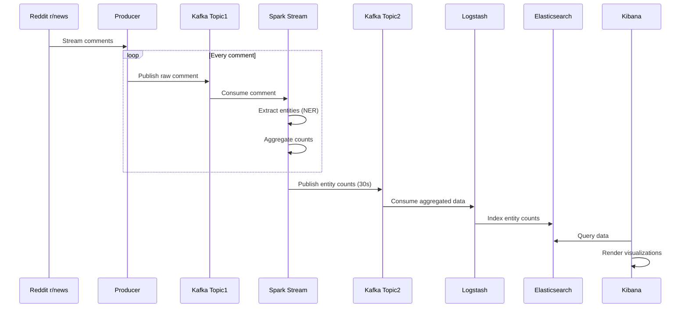
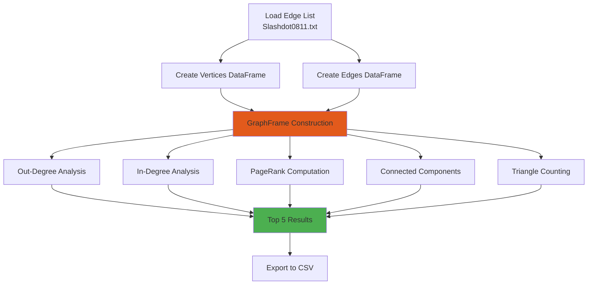

# Real-time NER Insights


**Built by:** [Akhila Susarla](https://github.com/Akhila-Susarla)

---

## What's This About?

I wanted to see what happens when you point NLP at the firehose of Reddit comments — so I built an end-to-end pipeline that **streams live Reddit comments**, **extracts named entities in real time**, and **visualizes trending people, places, and organizations** on a Kibana dashboard. Along the way I also dove into **large-scale graph analytics** on a real social network (Slashdot, 77K+ users and 828K+ edges) to explore PageRank, connected components, and triangle counts with PySpark.

This repo packs two fun explorations into distributed computing:

1. **Real-time NER Pipeline** — Reddit → Kafka → Spark Streaming → ELK Stack
2. **Slashdot Social Network Graph Analytics** — PySpark + GraphFrames on a real-world directed graph

---

## Table of Contents

- [Real-time NER Pipeline](#real-time-ner-pipeline)
  - [Architecture](#architecture)
  - [Components](#components)
  - [Data Flow](#data-flow)
  - [Tech Stack](#tech-stack)
- [Slashdot Graph Analytics](#slashdot-graph-analytics)
  - [Overview](#overview)
  - [Graph Metrics Computed](#graph-metrics-computed)
  - [Tech Stack](#tech-stack-1)
- [Repository Structure](#repository-structure)
- [Getting Started](#getting-started)
- [Usage](#usage)
- [Results and Visualizations](#results-and-visualizations)
- [What I Learned](#what-i-learned)
- [Future Ideas](#future-ideas)
- [References](#references)
- [License](#license)

---

## Real-time NER Pipeline

### Architecture

The pipeline follows a Lambda architecture pattern for real-time text analytics:


```mermaid
graph LR
    A[Reddit API<br/>r/news] -->|PRAW| B[Reddit Producer]
    B -->|Publish JSON| C[Kafka Topic 1<br/>Raw Comments]
    C -->|Stream| D[Spark Streaming<br/>NER Processing]
    D -->|NLTK NER| E[Entity Extraction]
    E -->|Aggregation| F[Entity Counts]
    F -->|Publish| G[Kafka Topic 2<br/>Entity Counts]
    G -->|Consume| H[Logstash]
    H -->|Index| I[Elasticsearch]
    I -->|Visualize| J[Kibana Dashboard]

    style A fill:#ff4500
    style C fill:#231f20
    style D fill:#e25a1c
    style G fill:#231f20
    style I fill:#005571
    style J fill:#005571
```

### Components

#### 1. Reddit Producer (`1_producer/reddit_producer.py`)

Streams live comments from Reddit's r/news subreddit:

- **Functionality**: Connects to Reddit API using PRAW (Python Reddit API Wrapper)
- **Output**: Publishes JSON messages to Kafka topic `topic1`
- **Data Structure**: Each message contains:
  - `body`: Comment text
  - `author`: Username
  - `created_utc`: Timestamp
  - `id`: Unique comment ID
  - `subreddit`: Source subreddit name
- **Rate Limiting**: 100ms sleep interval to prevent broker overload

#### 2. Spark NER Processor (`2_spark/ner_stream.py`)

PySpark Structured Streaming app that performs Named Entity Recognition:

- **Input**: Reads from Kafka `topic1`
- **Processing**:
  - Extracts named entities using NLTK's `ne_chunk`
  - Identifies PERSON, ORGANIZATION, GPE (Geopolitical Entity), and other entity types
  - Maintains running aggregated counts of each entity
- **Output**: Publishes entity counts to Kafka `topic2` every 30 seconds
- **NER Pipeline**:
  ```mermaid
  graph TD
      A[Raw Comment Text] --> B[Tokenization]
      B --> C[POS Tagging]
      C --> D[NE Chunking]
      D --> E[Entity Extraction]
      E --> F[Entity Aggregation]
      F --> G[JSON Output]
  ```

#### 3. Logstash Pipeline (`3_logstash/pipeline.conf`)

Bridges Kafka to Elasticsearch:

- **Input**: Consumes from Kafka `topic2`
- **Filter**: Parses JSON, extracts `entity` and `count` fields
- **Output**: Indexes data into Elasticsearch with daily indices (`ner_counts-YYYY.MM.dd`)
- **Authentication**: Connects to Elasticsearch with secure credentials

### Data Flow


```mermaid
sequenceDiagram
    participant R as Reddit r/news
    participant P as Producer
    participant K1 as Kafka Topic1
    participant S as Spark Stream
    participant K2 as Kafka Topic2
    participant L as Logstash
    participant E as Elasticsearch
    participant Ki as Kibana

    R->>P: Stream comments
    loop Every comment
        P->>K1: Publish raw comment
        K1->>S: Consume comment
        S->>S: Extract entities (NER)
        S->>S: Aggregate counts
    end
    S->>K2: Publish entity counts (30s)
    K2->>L: Consume aggregated data
    L->>E: Index entity counts
    Ki->>E: Query data
    Ki->>Ki: Render visualizations
```

### Tech Stack

| Technology | Version | Purpose |
|------------|---------|---------|
| Python | 3.8+ | Programming language |
| Apache Kafka | 4.0.0 | Message streaming broker |
| Apache Spark | 3.5.5 | Distributed stream processing |
| PySpark | 3.5.0 | Python API for Spark |
| NLTK | 3.8.1 | Natural Language Processing |
| PRAW | 7.7.1 | Reddit API wrapper |
| Logstash | 8.12.1 | Data ingestion pipeline |
| Elasticsearch | 8.12.1 | Search and analytics engine |
| Kibana | 8.12.1 | Data visualization platform |

---

## Slashdot Graph Analytics

### Overview

An exploration of the Slashdot social network dataset (November 2008) — representing friend/foe relationships between users. The graph contains **77,360 vertices** (users) and **828,161 directed edges** (relationships).

**Dataset**: [Slashdot Zoo network from Stanford SNAP](https://snap.stanford.edu/data/soc-Slashdot0811.html)
- **Format**: Tab-separated edge list
- **Graph Type**: Directed graph
- **Self-loops**: Removed during preprocessing

### Graph Analytics Pipeline


```mermaid
graph TB
    A[Load Edge List<br/>Slashdot0811.txt] --> B[Create Vertices DataFrame]
    A --> C[Create Edges DataFrame]
    B --> D[GraphFrame Construction]
    C --> D
    D --> E[Out-Degree Analysis]
    D --> F[In-Degree Analysis]
    D --> G[PageRank Computation]
    D --> H[Connected Components]
    D --> I[Triangle Counting]

    E --> J[Top 5 Results]
    F --> J
    G --> J
    H --> J
    I --> J

    J --> K[Export to CSV]

    style D fill:#e25a1c
    style J fill:#4CAF50
```

### Graph Metrics Computed

#### 1. Out-Degree Centrality
- Identifies nodes with the highest number of outgoing edges
- Represents users who mark many others as friends/foes

#### 2. In-Degree Centrality
- Identifies nodes with the highest number of incoming edges
- Represents popular users who are marked by many others

#### 3. PageRank
- Measures node importance based on link structure
- Reset probability: 0.15 (damping factor: 0.85), 10 iterations

#### 4. Connected Components
- Identifies clusters of interconnected nodes
- Two approaches: core graph (degree ≥ 2) and full graph

#### 5. Triangle Count
- Counts triangles each node participates in
- Measures clustering coefficient and local density

### Tech Stack

| Technology | Version | Purpose |
|------------|---------|---------|
| PySpark | 3.x | Distributed graph processing |
| GraphFrames | 0.6 | Graph algorithms on Spark |
| Databricks | Community | Cloud execution environment |
| Python | 3.9 | Programming language |

---

## Repository Structure

```
Real-time-NER-Insights/
├── README.md
│
├── Question_1/                            # Real-time NER Pipeline
│   ├── 1_producer/
│   │   └── reddit_producer.py             # Reddit comment streamer
│   ├── 2_spark/
│   │   └── ner_stream.py                  # Spark NER processor
│   ├── 3_logstash/
│   │   └── pipeline.conf                  # Logstash configuration
│   ├── Output Screenshots/                # Kibana visualizations
│   │   ├── Barplot_15mins.png
│   │   ├── Barplot_30mins.png
│   │   ├── Barplot_45mins.png
│   │   ├── Barplot_60mins.png
│   │   ├── Donutplot_15mins.png
│   │   ├── Donutplot_30mins.png
│   │   ├── Donutplot_45mins.png
│   │   ├── Donutplot_60mins.png
│   │   ├── Terminal_running_1.png
│   │   └── Terminal_running_2.png
│   ├── readme.md                          # NER-specific documentation
│   └── requirements.txt                   # Python dependencies
│
└── Question_2/                            # Graph Analytics
    ├── A3 Q2 - soc_slashdot.ipynb         # Jupyter notebook
    ├── A3 Q2 - soc_slashdot.html          # Exported HTML
    └── Summary_and_Outputs.docx           # Results summary
```

---

## Getting Started

### Prerequisites

- **OS**: Linux, macOS, or Windows with WSL
- **RAM**: 8GB minimum (16GB recommended)
- **Java**: JDK 8 or 11 (for Spark and Kafka)

### NER Pipeline Setup

#### 1. Install Python dependencies

```bash
cd Question_1
pip install -r requirements.txt
```

#### 2. Download NLTK data

```python
import nltk
nltk.download('punkt')
nltk.download('averaged_perceptron_tagger')
nltk.download('maxent_ne_chunker')
nltk.download('words')
```

#### 3. Configure Reddit API credentials

1. Create a Reddit app at https://www.reddit.com/prefs/apps
2. Export your credentials:

```bash
export REDDIT_CLIENT_ID="your_client_id_here"
export REDDIT_CLIENT_SECRET="your_client_secret_here"
```

#### 4. Install and start Kafka

```bash
wget https://downloads.apache.org/kafka/4.0.0/kafka_2.13-4.0.0.tgz
tar -xzf kafka_2.13-4.0.0.tgz && cd kafka_2.13-4.0.0

KAFKA_CLUSTER_ID="$(bin/kafka-storage.sh random-uuid)"
bin/kafka-storage.sh format --standalone -t $KAFKA_CLUSTER_ID -c config/server.properties
bin/kafka-server-start.sh config/server.properties
```

#### 5. Install and start ELK Stack

**Elasticsearch:**
```bash
wget https://artifacts.elastic.co/downloads/elasticsearch/elasticsearch-8.12.1-darwin-x86_64.tar.gz
tar -xzf elasticsearch-8.12.1-darwin-x86_64.tar.gz && cd elasticsearch-8.12.1
bin/elasticsearch
```

**Kibana:**
```bash
wget https://artifacts.elastic.co/downloads/kibana/kibana-8.12.1-darwin-x86_64.tar.gz
tar -xzf kibana-8.12.1-darwin-x86_64.tar.gz && cd kibana-8.12.1
bin/kibana
```

**Logstash:**
```bash
wget https://artifacts.elastic.co/downloads/logstash/logstash-8.12.1-darwin-x86_64.tar.gz
tar -xzf logstash-8.12.1-darwin-x86_64.tar.gz
```

#### 6. Install Apache Spark

```bash
wget https://downloads.apache.org/spark/spark-3.5.5/spark-3.5.5-bin-hadoop3.tgz
tar -xzf spark-3.5.5-bin-hadoop3.tgz
```

### Graph Analytics Setup

**Option A — Databricks (easiest):**
1. Sign up at https://community.cloud.databricks.com
2. Upload `A3 Q2 - soc_slashdot.ipynb` and the dataset
3. `%pip install graphframes`

**Option B — Local PySpark:**
```bash
pip install pyspark==3.5.0 graphframes
```

---

## Usage

### Running the NER Pipeline

You'll need 6 terminals running simultaneously — it feels like orchestrating a small distributed system (because it is one!):

| Terminal | Command |
|----------|---------|
| 1 | Start Kafka server |
| 2 | Start Elasticsearch |
| 3 | Start Kibana (http://localhost:5601) |
| 4 | `cd Question_1/1_producer && python3 reddit_producer.py` |
| 5 | `spark-submit --packages org.apache.spark:spark-sql-kafka-0-10_2.12:3.5.5 Question_1/2_spark/ner_stream.py` |
| 6 | `logstash -f Question_1/3_logstash/pipeline.conf` |

### Running the Graph Analytics

```bash
jupyter notebook "Question_2/A3 Q2 - soc_slashdot.ipynb"
```

---

## Results and Visualizations

### NER Pipeline

Real-time Kibana dashboards showing:

- **Bar Charts**: Most frequent named entities at 15, 30, 45, and 60-minute intervals
- **Donut Charts**: Distribution of top entities over time
- Entities trend with current news events and update every 30 seconds

Sample outputs are in `Question_1/Output Screenshots/`.

### Graph Analytics

| Metric | What It Reveals |
|--------|----------------|
| **Out-Degree Top 5** | Users who tagged the most friends/foes |
| **In-Degree Top 5** | Most popular/referenced users |
| **PageRank Top 5** | Most influential nodes in the network |
| **Connected Components** | Largest clusters of interconnected users |
| **Triangle Count Top 5** | Users in the most tightly-knit groups |

**Graph Stats**: 77,360 vertices · 828,161 edges · directed · avg degree ~10.7

---

## What I Learned

### Technical Skills Picked Up

1. **Stream Processing** — Building production-grade pipelines with Kafka + Spark
2. **NLP at Scale** — Running NER on a live data stream, not just static text
3. **Graph Analytics** — PageRank, connected components, and triangle counts on real data
4. **ELK Stack** — End-to-end ingestion → storage → visualization
5. **Distributed Computing** — Thinking in terms of partitions, offsets, and parallelism

### Design Patterns Applied

1. **Lambda Architecture** — Combining real-time and batch processing
2. **Producer-Consumer** — Decoupled ingestion and processing via Kafka
3. **ETL Pipeline** — Extract (Reddit) → Transform (Spark NER) → Load (Elasticsearch)

---

## Troubleshooting

**Kafka consumer lag increasing?**
→ Increase Spark executor memory or reduce batch interval

**NLTK data not found?**
→ Manually run the `nltk.download()` commands from the setup section

**Logstash can't connect to Elasticsearch?**
→ Double-check credentials and certificate path in `pipeline.conf`

**GraphFrames not found?**
→ `%pip install graphframes`

**Checkpoint directory error?**
→ `spark.sparkContext.setCheckpointDir("/tmp/graphframe-chkpt")`

---

## Future Ideas

### NER Pipeline
- Add sentiment analysis alongside entity extraction
- Support multiple subreddits simultaneously
- Deploy on cloud infrastructure (AWS/GCP/Azure)
- Build anomaly detection for trending entities
- Real-time alerting for specific entity patterns

### Graph Analytics
- Community detection (Louvain, Label Propagation)
- Betweenness centrality for bridge nodes
- Temporal evolution analysis
- Link prediction
- Interactive visualization with D3.js

---

## References

1. [Apache Kafka Documentation](https://kafka.apache.org/documentation/)
2. [Spark Structured Streaming Guide](https://spark.apache.org/docs/latest/structured-streaming-programming-guide.html)
3. [NLTK Book](https://www.nltk.org/book/)
4. [GraphFrames Documentation](https://graphframes.github.io/graphframes/docs/_site/index.html)
5. [Slashdot Dataset — Stanford SNAP](https://snap.stanford.edu/data/soc-Slashdot0811.html)
6. [Elasticsearch Reference](https://www.elastic.co/guide/en/elasticsearch/reference/current/index.html)

---

## License

MIT License — feel free to use, modify, and build upon this work.

---

## Contact

**Akhila Susarla** — [GitHub](https://github.com/Akhila-Susarla)
